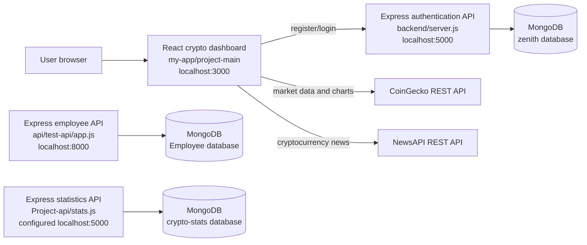
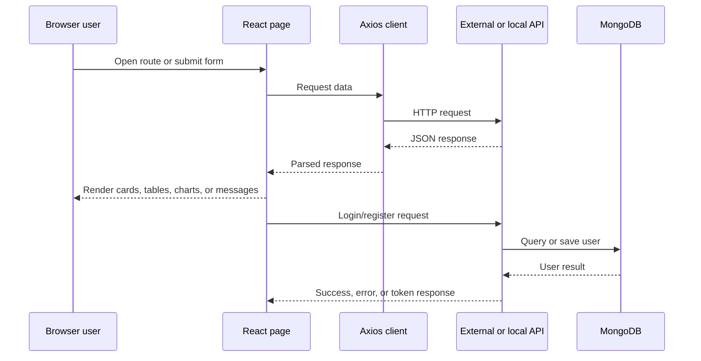

# Project Sumago Documentation

## 1. Overview

Project Sumago is a Windows workspace containing several related JavaScript applications and experiments:

- **Crypto dashboard:** `my-app/project-main`
- **Authentication API:** `backend`
- **Employee CRUD API:** `api/test-api`
- **Crypto statistics API and seed script:** `Project-api`
- **Minimal React starter:** `my-app/new-app`
- **Standalone Bootstrap page and React sample:** `HTml`

The crypto dashboard is the primary user-facing application. It provides cryptocurrency market data, coin details, rankings, news, authentication screens, informational pages, and contact/about content.

This repository is currently organized as multiple independent projects rather than a single workspace-level monorepo. Each project has its own dependencies and startup process.

## 2. High-Level Architecture



### Important deployment fact

Both `backend/server.js` and `Project-api/stats.js` default to port `5000`. They cannot run at the same time without changing one port. The React app's local Axios client also assumes the authentication API is available at `http://localhost:5000/api`.

## 3. Technology Stack

### Primary frontend: `my-app/project-main`

- React `18.3.1`
- React DOM `18.3.1`
- Create React App / `react-scripts` `5.0.1`
- React Router DOM `6.24.0`
- Axios `1.7.2`
- Axios Retry `4.4.1`
- React Bootstrap `2.10.4`
- Bootstrap `5.3.3`
- Chart.js `4.4.3`
- `react-chartjs-2` `5.2.0`
- Font Awesome packages `6.5.2`
- Testing Library and Jest DOM
- Web Vitals
- Plain CSS modules/files under `src/Web-css`

### Node.js APIs

- Node.js CommonJS modules
- Express `4.19.2`
- Mongoose `8.x`
- MongoDB
- CORS
- `bcryptjs` for password hashing
- `jsonwebtoken` for login tokens
- `body-parser` in the statistics service

### External services

- CoinGecko API: `https://api.coingecko.com/api/v3`
- NewsAPI: `https://newsapi.org/v2/everything`
- Local MongoDB databases: `zenith`, `Employee`, and `crypto-stats`

## 4. Frontend Application

Location: `my-app/project-main`

### Bootstrap and application shell

`src/index.js` creates the React root, imports global CSS and Bootstrap, and renders `App` inside `React.StrictMode`.

`src/App.js` is the application shell. It owns the current `user` state and renders:

- `Header`
- React Router routes
- The current page
- `Footer`

### Routes

| Path | Component | Purpose |
|---|---|---|
| `/` | `Home` | Dashboard home page with global and market data |
| `/details` | `CryptoDetail` | Coin detail view using a selected coin identifier |
| `/details/:id` | `CryptoDetailPage` | Route-based coin details and market chart |
| `/cryptocurrencies` | `Cryptocurrencies` | Market list, search/filtering, and chart data |
| `/about` | `About` | Product/about information |
| `/contact` | `Contact` | Contact form/content page |
| `/login` | `LoginForm` | User login |
| `/register` | `Register` | User registration |
| `/ranking` | `Ranking` | Cryptocurrency ranking list |
| `/news` | `News` | Paginated cryptocurrency news |

### Frontend modules and responsibilities

| File | Responsibility |
|---|---|
| `App.js` | Root layout, user state, route definitions |
| `Header.js` | Site header and navigation; receives `user` and `setUser` |
| `Navbar.js` | Additional navigation/sample navigation component |
| `Footer.js` | Footer, social links, and site-level footer content |
| `Home.js` | Global market statistics, market list, cards, and dashboard sections |
| `Cryptocurrencies.js` | Coin market data, filtering/search behavior, and chart requests |
| `CryptoDetails.js` | Coin market list/detail-oriented view |
| `CryptoDetail.js` | Direct coin detail and market-chart requests |
| `CryptoDetailPage.js` | Route parameter based detail page for `/details/:id` |
| `Ranking.js` | Loads CoinGecko market data and displays rankings |
| `News.js` | Loads NewsAPI articles and paginates 12 articles per page |
| `LoginForm.js` | Posts email/password to the local authentication API and updates user state |
| `Register.js` | Posts username/email/password to the local authentication API |
| `FormComponent.js` | Reusable form-oriented component |
| `HeroSection.js` | Home-page hero section |
| `About.js` | About page content |
| `Contact.js` | Contact page content |
| `reportWebVitals.js` | CRA performance measurement hook |
| `setupTests.js` | Jest DOM test setup |

### HTTP clients

#### CoinGecko client: `src/axiosInstance.js`

- Base URL: `https://api.coingecko.com/api/v3`
- Used by market and coin pages.
- Has a custom response interceptor that retries requests when the request config contains a `retry` value.
- CoinGecko endpoints used in the source include:
  - `GET /global`
  - `GET /coins/markets`
  - `GET /coins/{id}`
  - `GET /coins/{id}/market_chart`

#### Local API client: `src/axiosInstance2.js`

- Base URL: `http://localhost:5000/api`
- Used by registration and login.
- Configured with `axios-retry` for 3 retries using exponential backoff.

#### NewsAPI

`News.js` calls:

```text
GET https://newsapi.org/v2/everything?q=cryptocurrency&apiKey=<configured-key>
```

The current implementation places the API key in frontend source code. This exposes the key to browser users and should be replaced with an environment variable or a server-side proxy before production deployment.

### Frontend data flow



### Styling and visual assets

- Global styles: `src/index.css`
- App styles: `src/Web-css/App.css`
- Page-specific styles: `src/Web-css/*.css`
- Form styles: `src/FormStyle.css`
- Images and assets: `src/Web-img/`
- Bootstrap and Font Awesome are loaded through the package and public HTML configuration.

## 5. Authentication API

Location: `backend/server.js`

### Runtime

- Framework: Express
- Default port: `5000`, or `process.env.PORT`
- Database: MongoDB at `mongodb://localhost:27017/zenith`
- Model: `User`

### User schema

| Field | Type | Rules |
|---|---|---|
| `username` | String | Required |
| `email` | String | Required and unique |
| `password` | String | Required; stored as a bcrypt hash |

### Endpoints

#### `POST /api/register`

Request body:

```json
{
  "username": "example-user",
  "email": "user@example.com",
  "password": "plain-text-password"
}
```

Behavior:

1. Looks up an existing user by email.
2. Returns HTTP `400` if the email already exists.
3. Generates a bcrypt salt with 10 rounds.
4. Hashes the password.
5. Saves the new user.
6. Returns a success message.

#### `POST /api/login`

Request body:

```json
{
  "email": "user@example.com",
  "password": "plain-text-password"
}
```

Behavior:

1. Looks up the user by email.
2. Returns HTTP `400` if the user does not exist.
3. Compares the submitted password with the stored bcrypt hash.
4. Signs a JWT intended to expire after one hour.
5. Returns the token and basic user information.

Expected successful response shape:

```json
{
  "success": true,
  "token": "<jwt>",
  "user": {
    "id": "<mongo-id>",
    "username": "example-user",
    "email": "user@example.com"
  }
}
```

### Authentication implementation risks

- The file declares `jwtSecret` but calls `jwt.sign` with `JWT_SECRET`. JavaScript is case-sensitive, so login currently references an undefined variable and is expected to fail before returning a token. Use one consistently named secret.
- The JWT secret is randomly generated at server startup. Restarting the server invalidates previously issued tokens. Production deployments should load a stable secret from an environment variable.
- The MongoDB URI is hard-coded and should be configured through environment variables.
- There is no JWT verification middleware or protected endpoint in the current backend.
- Validation is minimal; request fields are not explicitly checked before database operations.

## 6. Employee CRUD API

Location: `api/test-api/app.js`

This is a separate Express/Mongoose practice API. It does not connect to the crypto dashboard.

### Runtime

- Port: `8000`
- Database: `mongodb://localhost:27017/Employee`
- Model: `Empinfo`
- CORS enabled
- JSON request bodies enabled

### Employee schema

| Field | Type |
|---|---|
| `Empid` | Number |
| `Empname` | String |
| `Empsalary` | Number |

### Endpoints

| Method | Endpoint | Behavior |
|---|---|---|
| `GET` | `/empget` | Returns all employee records |
| `POST` | `/emppost` | Creates an employee from `Empid`, `Empname`, and `Empsalary` |
| `DELETE` | `/empdelete/:id` | Deletes one employee by MongoDB document ID |
| `PUT` | `/updatedata/:id` | Updates employee fields by MongoDB document ID |

### Known implementation issues

- Several error paths log errors without sending an HTTP error response.
- The update handler contains an unreachable `res.status(404)` after a bare `return`.
- The delete response is a placeholder string rather than a descriptive result.
- The API has no request validation or authentication.

## 7. Crypto Statistics API

Location: `Project-api/stats.js`

This is another independent Express/Mongoose service intended to expose aggregate crypto platform statistics.

### Runtime

- Default port: `5000`
- Database: `mongodb://localhost:27017/crypto-stats`
- CORS enabled
- JSON parsing through `body-parser`
- Model: `Stats`

### Stats schema

| Field | Type |
|---|---|
| `totalUsers` | Number |
| `totalTransactions` | Number |
| `totalVolume` | Number |
| `marketCap` | Number |

### Endpoint

#### `GET /api/stats`

Returns the first document in the `Stats` collection. If the database request fails, the service responds with HTTP `500`.

### Seed script

Location: `Project-api/seed.js`

The seed script:

1. Connects to the `crypto-stats` database.
2. Deletes all existing `Stats` documents.
3. Inserts one document with sample values:
   - `totalUsers`: `1000`
   - `totalTransactions`: `5000`
   - `totalVolume`: `120000`
   - `marketCap`: `2500000`
4. Closes the MongoDB connection.

Because this service uses port `5000`, it must be assigned another port when the authentication server is running.

## 8. Minimal React Starter

Location: `my-app/new-app`

This is a Create React App starter with:

- React `18.3.1`
- React DOM
- `react-scripts` `5.0.1`
- Testing Library
- Web Vitals

It has the standard CRA scripts: `start`, `build`, `test`, and `eject`. It does not currently contain the crypto application's routes, API clients, or backend integration.

## 9. Standalone HTML and React Sample

Location: `HTml`

- `App.html` is a standalone Bootstrap 5.3.3 HTML page containing a sample navbar and search form.
- `file.js` is a small React component that renders `Hello Budddy`.
- This folder is not wired into the main React application and has no package manifest of its own.

## 10. Runbook

### Prerequisites

- Node.js and npm
- MongoDB running locally
- Internet access for CoinGecko and NewsAPI
- A valid NewsAPI key if the news screen is used

### Run the main frontend

```powershell
Set-Location "my-app/project-main"
npm install
npm start
```

Open `http://localhost:3000`.

### Run the authentication backend

```powershell
Set-Location "backend"
npm install
node server.js
```

The API is expected at `http://localhost:5000`.

Before using login, fix the `jwtSecret` naming mismatch described above and configure a stable secret.

### Run the employee API

```powershell
Set-Location "api/test-api"
npm install
node app.js
```

The API runs at `http://localhost:8000`.

### Seed and run the statistics API

```powershell
Set-Location "Project-api"
npm install
node seed.js
node stats.js
```

Change the statistics service port before starting it if the authentication backend is already using `5000`.

### Common npm scripts for React apps

```text
npm start   Start the development server
npm test    Run the test runner
npm run build  Create a production build
npm run eject  Eject Create React App configuration; irreversible
```

## 11. Testing Status

The React projects include Create React App test dependencies and starter `App.test.js` files. The backend projects do not define meaningful automated test scripts; `backend/package.json` only contains a placeholder failing test command.

Recommended test coverage:

- Authentication registration and login success/error paths.
- JWT creation and token verification.
- Employee CRUD status codes and validation.
- CoinGecko request loading, empty, and error states.
- NewsAPI failure handling and pagination.
- React route rendering and protected behavior once authentication is added.

## 12. Configuration and Security Recommendations

1. Move MongoDB URIs, API keys, ports, and JWT secrets into environment variables.
2. Never expose the NewsAPI key in browser JavaScript.
3. Fix the `jwtSecret` versus `JWT_SECRET` mismatch before testing login.
4. Use a stable cryptographically strong JWT secret in deployment.
5. Add JWT verification middleware for protected routes.
6. Add request validation and consistent error response shapes to all APIs.
7. Avoid running the authentication and statistics services on the same port.
8. Add rate limiting and stronger CORS configuration for public deployments.
9. Add loading, error, and empty states consistently across API-backed screens.
10. Add automated API tests and frontend integration tests.

## 13. Suggested Future Structure

For a production-ready version, the workspace could be consolidated into a clearer layout:

```text
project-sumago/
  apps/
    web/                 # React crypto dashboard
  services/
    auth-api/            # registration, login, JWT middleware
    stats-api/           # crypto statistics
    employee-api/        # keep only if still required
  packages/
    shared-types/        # shared request/response types
  docs/
    architecture.md
  .env.example
  package.json           # workspace scripts
```

The current code can remain separate during development, but the production architecture should define one primary frontend, explicit service ownership, environment-based configuration, and a single documented way to start the required services.
